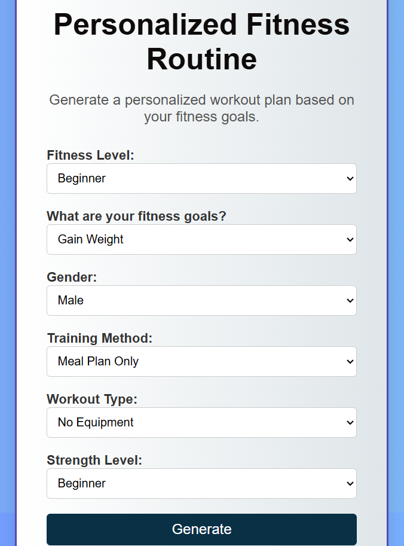
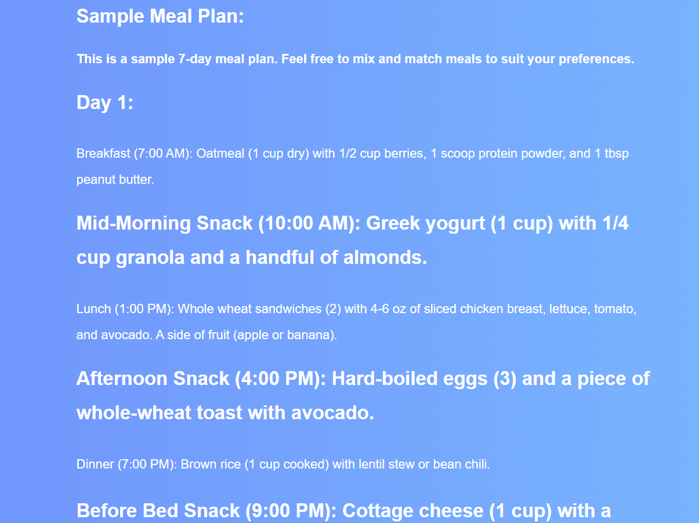

# 🏋️ Personalized Fitness Routine Generator – Python + HTML Web App

A web-based fitness planner that dynamically generates personalized workout routines based on user preferences. It features a clean HTML/CSS frontend and a Python (Flask) backend to handle logic, form inputs, and display custom workout recommendations.

---

## 🌐 Live Form Interface

Users fill out a simple form that asks for:

- Fitness level (Beginner, Intermediate, Advanced)
- Fitness goals (Lose Weight, Gain Weight, Build Muscle)
- Gender
- Strength level
- Training method (Meal Plan or Custom Routine)
- Workout type (Gym, No Equipment, Bodyweight)

---

## 🖼️ Screenshots

### 🧾 Input Form – `index.html`

---

### ✅ Results Page – `recommendations.html`

Displays the selected goal, gender, and strength level, followed by a cleanly formatted workout plan.

---

## 🔄 How It Works

1. The form in `index.html` collects user data
2. On submission, the backend (`app.py`) processes the input
3. A workout plan is generated and displayed using `recommendations.html`
4. All logic is handled server-side, and the frontend is rendered with Jinja templating

---

## 📄 Pages Included

| File | Description |
|------|-------------|
| `index.html` | User form for selecting fitness preferences |
| `recommendations.html` | Output page showing personalized plan |
| `index.css` | Styling for the form |
| `recommendations.css` | Styling for the results page |
| `app.py` | Python backend (Flask) for logic and routing |

---

## 🧠 Features

- Responsive design with semantic HTML and CSS
- Dynamic workout generation based on user choices
- Jinja templating to inject values directly into HTML
- Organized and readable weekly fitness suggestions

---

## 🛠️ Technologies Used

- HTML5 + CSS3
- Python 3
- Flask framework
- Jinja2 templating engine

---

## 📁 Project Structure
fitness-routine-generator/
├── app.py
├── templates/
│ ├── index.html
│ └── recommendations.html
├── static/
│ ├── index.css
│ └── recommendations.css
├── index_page.png
├── recommendations_page.png
└── README.md

---

## 📌 Notes

✅ Solo full-stack project  
🧠 Developed as part of hands-on learning in web and logic integration  
💪 Designed with usability, personalization, and simplicity in mind  
🔓 Open for further enhancements — login system, PDF download, or meal tracking

---

**Made with 💻 and ❤️ by Mariam Shariff**

